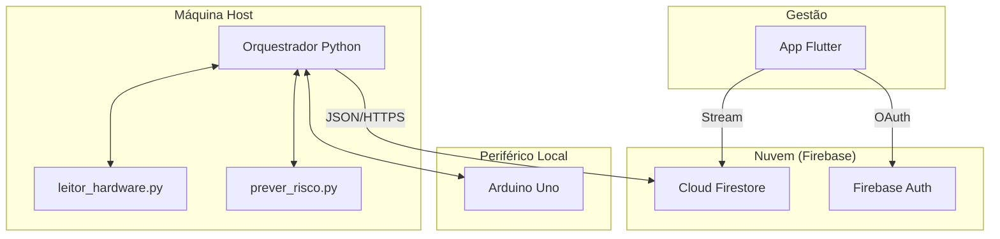

# AVALIAÇÃO TÉCNICA DO PROJETO — INVENTÁRIO

Este documento apresenta uma análise técnica detalhada e uma auditoria de segurança do projeto **INVENTÁRIO**, baseada estritamente na inspeção do código-fonte.

---

## 1. Visão Geral

*   **Objetivo:** Automatizar o inventário técnico e realizar a manutenção preditiva de falhas em computadores de unidades regionais.
*   **Problema resolvido:** Falta de controle centralizado de ativos de hardware e ocorrência de falhas críticas inesperadas em dispositivos de armazenamento.
*   **Usuários:** Técnicos de hardware (bancada local) e Gestores (App Flutter).
*   **Principais Componentes:**
    *   **Orquestrador Python (`main.py`):** Coordena a coleta, predição e envio de dados.
    *   **Módulo de Identificação (`leitor_hardware.py`):** Coleta seriais de hardware.
    *   **Módulo de Predição (`prever_risco.py`):** Inferência via Machine Learning (Random Forest).
    *   **Firmware Arduino (`bancada_token.ino`):** Sinalização física (LEDs/Buzzer).
    *   **Backend:** Firebase Cloud Firestore e Authentication.
*   **Tecnologias:** Python, C++, Dart (Flutter), Firebase, Scikit-Learn, Smartmontools.
*   **Papel do Arduino:** Dispositivo periférico para sinalização visual/sonora e confirmação de presença física da bancada.

## 2. Objetivo de Segurança

*   **Garantia de Identidade:** O sistema identifica a máquina por atributos de hardware, mas não possui prova criptográfica de que a máquina é quem afirma ser.
*   **Diferenciação de Máquinas:** Realizada por consulta ao Firestore. Máquinas não encontradas ou sem vínculo são marcadas como `quarentena`.
*   **Autenticação da Máquina:** **Não identificado no código.** Não há troca de segredos entre a máquina e o servidor.
*   **Autenticação do Arduino:** Baseada em um comando `PING` estático. Não há troca de chaves ou certificados.
*   **Validação Física:** Baseia-se na leitura de seriais via OS (BIOS, UUID, Disco).
*   **Mecanismo contra Falsificação:** **Não identificado no código.** Os identificadores trafegam em texto claro (JSON).
*   **Definição de "Máquina Genuína":** Aquela cujo identificador está ativo na coleção `maquinas` do Firestore.

## 3. Arquitetura

## 4. Fluxo Completo de Funcionamento

1.  **Inicialização:** O técnico executa o script e informa o código CIE da escola.
2.  **Identificação do Periférico:** A aplicação local conecta ao Arduino via Serial.
3.  **Aperto de Mão (Handshake):** Aplicação envia `PING`; Arduino responde com seu ID fixo.
4.  **Coleta de Identidade:** Aplicação extrai seriais de hardware (BIOS, UUID, etc.).
5.  **Extração de Saúde:** Aplicação lê atributos SMART do disco via `smartctl`.
6.  **Cálculo de Risco:** O modelo de IA processa os dados e gera a probabilidade de falha.
7.  **Validação Cloud:** O sistema verifica o status da máquina no banco de dados.
8.  **Feedback Físico:** A aplicação envia o estado de LED ao Arduino.
9.  **Persistência:** Dados são salvos no Firestore (ou na fila offline se não houver rede).

## 5. Identificação da Máquina

Realizada pelo módulo `leitor_hardware.py`:
*   **Atributos:** Serial da BIOS, UUID de hardware, Serial da Placa-mãe e Serial do Disco.
*   **Cadeia de Fallback:** BIOS -> UUID -> Placa-mãe -> Disco.
*   **Tratamento:** Limpeza de strings genéricas ("None", "Default String").
*   **Transformação:** **Não há uso de Hash.** Os identificadores são usados em texto puro.
*   **Armazenamento:** O identificador final é a chave primária do documento no Firestore.

## 6. Arduino

### 6.1 Papel do Hardware
**O Arduino atua apenas como periférico de sinalização (LEDs/Buzzer).**
*   **Autenticação da Máquina:** O Arduino não participa.
*   **Identidade Própria:** Possui um `BANCADA_ID` constante no código.
*   **Segredos:** **Nenhum segredo ou chave identificado no firmware.**
*   **Criptografia:** O Arduino não realiza cálculos criptográficos.
*   **Validação:** O Arduino não valida informações da máquina.

## 7. Comunicação Computador-Arduino

*   **Interface:** USB Serial (9600 baud).
*   **Protocolo:** JSON sobre Serial.
*   **Comandos:** `PING`, `STATUS` (com campos estado, risco, serial), `RESET`.
*   **Respostas:** Confirmações JSON com `ok: true`.
*   **Tratamento de Erros:** Timeouts de 3s e reset de buffer na conexão.

## 8. Autenticação

*   **Realidade:** A autenticação forte existe apenas para o usuário gestor (Firebase Auth).
*   **Hardware:** Não há autenticação real entre PC e Arduino; a confiança é baseada na conexão física.
*   **Validação:** Ocorre no cliente (Python) e na interface de gestão (Flutter).

## 9. Challenge-Response

**Não foi identificado mecanismo de challenge-response no código analisado.**

## 10. Proteção contra Replay

**Não foi identificada proteção contra replay.** As mensagens serial podem ser capturadas e reproduzidas sem expiração ou nonces.

## 11. Clonagem

*   **Arduino:** Risco alto de clonagem, pois o ID é uma constante no firmware e não há chaves privadas.
*   **Máquina:** Identidade baseada em atributos do SO que podem ser emulados em VMs.

## 12. Manipulação da Aplicação

*   **Controle do Cliente:** O técnico tem controle administrativo do host. É possível alterar o script Python para ignorar o Arduino ou forçar resultados "OK" para máquinas críticas.
*   **Confiança:** O servidor (Firestore) confia nos dados enviados pelo cliente autenticado via chave de serviço.

## 13. Banco de Dados e Backend

*   **Banco:** Firebase Cloud Firestore.
*   **Dados:** Inventário completo + Telemetria SMART + Logs de Eventos.
*   **Regras:** Implementadas via `firestore.rules` (filtros por CIE e Perfil).
*   **Acesso:** O cliente Python usa uma chave de conta de serviço (`serviceAccountKey.json`).

## 14. Máquina Desconhecida / Quarentena

*   **Detecção:** Busca negativa no Firestore.
*   **Ação:** Cadastro automático com `status: "quarentena"` e sinalização visual de alerta no Arduino.
*   **Liberação:** Manual, feita por gestor via App Flutter.

## 15. Modelo de Ameaça

*   **Máquina Falsificada:** Possível via emulação de atributos de hardware no OS.
*   **Arduino Clonado:** Possível; basta carregar o firmware em outra placa Uno.
*   **Replay:** Possível na interface Serial; ausência de nonces/timestamps.
*   **Aplicação Modificada:** Risco crítico, pois o cliente detém a lógica de validação.

## 16. Segredos e Chaves

*   **serviceAccountKey.json:** Chave administrativa do Firebase armazenada localmente na pasta `bancada/`.
*   **Firmware:** Não contém segredos.

## 17. Integridade

**Não foram identificados mecanismos de verificação de integridade (assinatura de código ou firmware).**

## 18. Logs e Auditoria

*   **Registros:** Coleção `eventos` registra quarentenas e riscos críticos.
*   **Investigação:** Permite rastrear máquinas e operadores, dependendo da fidedignidade do arquivo `config.json`.

## 19. Limitações Conhecidas

*   Comunicação Serial em texto claro e sem proteção contra replay.
*   Identidade do Arduino baseada em constante no código.
*   Dependência total da integridade do Sistema Operacional do host.
*   Lógica de segurança concentrada no cliente (Python).

## 20. Matriz Técnica

| Característica | Implementado? | Onde | Funcionamento |
| :--- | :---: | :--- | :--- |
| Identificação da máquina | Sim | `leitor_hardware.py` | Fallback BIOS > UUID > Placa > Disco |
| Identidade do Arduino | Sim | `bancada_token.ino` | String constante `BANCADA_ID` |
| Arduino autentica a máquina | Não | - | Atua como sinalizador |
| Segredo no Arduino | Não | - | Não identificado |
| Challenge-response | Não | - | Não identificado |
| Proteção contra replay | Não | - | Não identificado |
| Criptografia na Serial | Não | - | JSON em texto claro |
| Validação no servidor | Não | - | Firestore é passivo |
| Quarentena | Sim | `main.py` | Lógica de busca no banco |

## 21. Conclusão Técnica

O projeto apresenta um sistema funcional de inventário e predição. Do ponto de vista de segurança, o Arduino atua como um **periférico de sinalização física** e não como uma raiz de confiança criptográfica. A segurança da identidade da máquina baseia-se na dificuldade de forjar seriais de hardware em ambiente físico, mas é vulnerável a manipulações em nível de software no host. Pontos para melhoria futura incluem a implementação de *nonces* na comunicação serial e a migração da lógica de aprovação para *Cloud Functions*.
